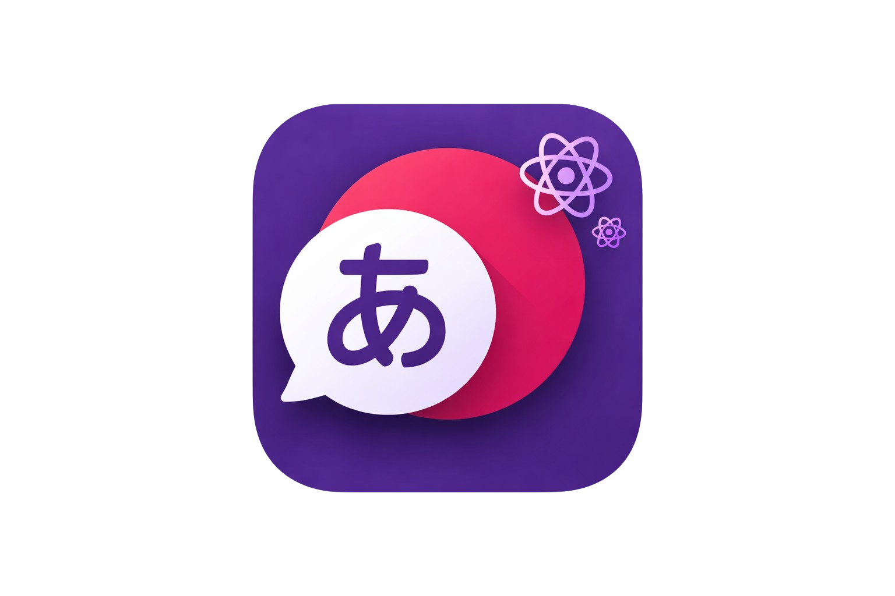
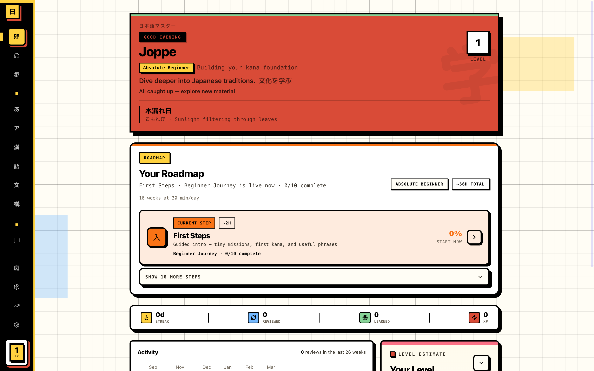
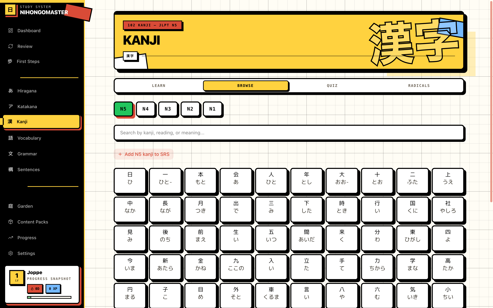
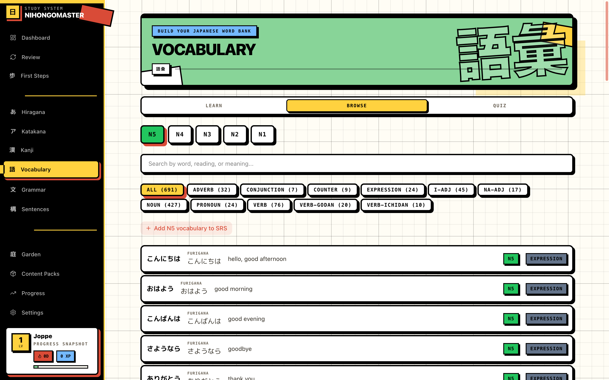
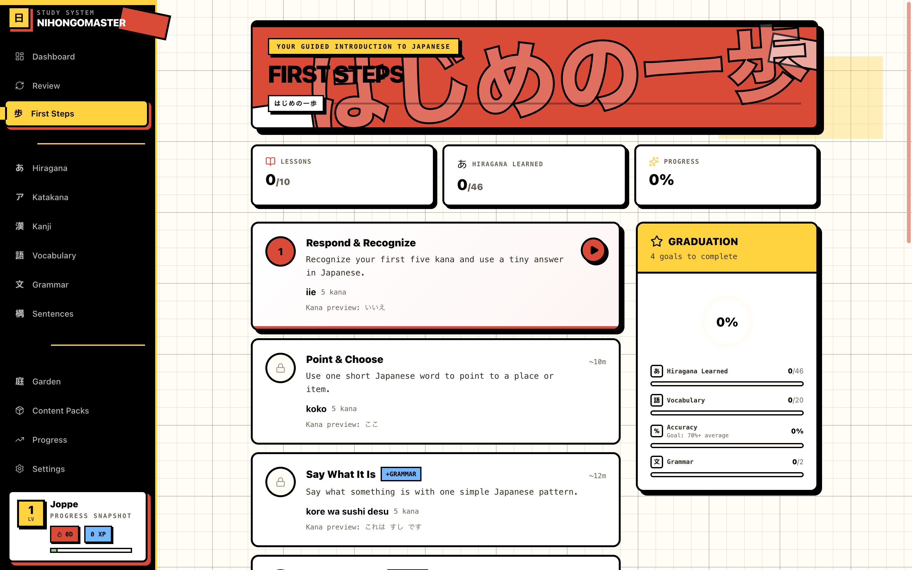
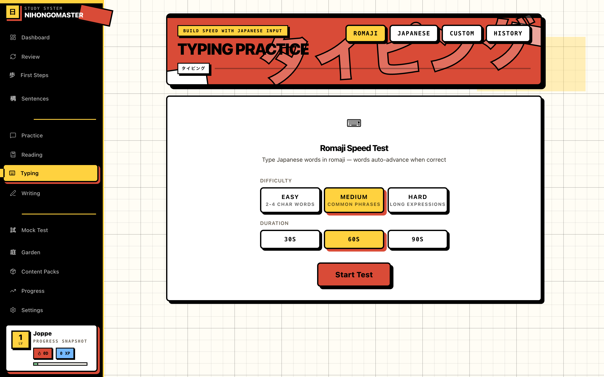
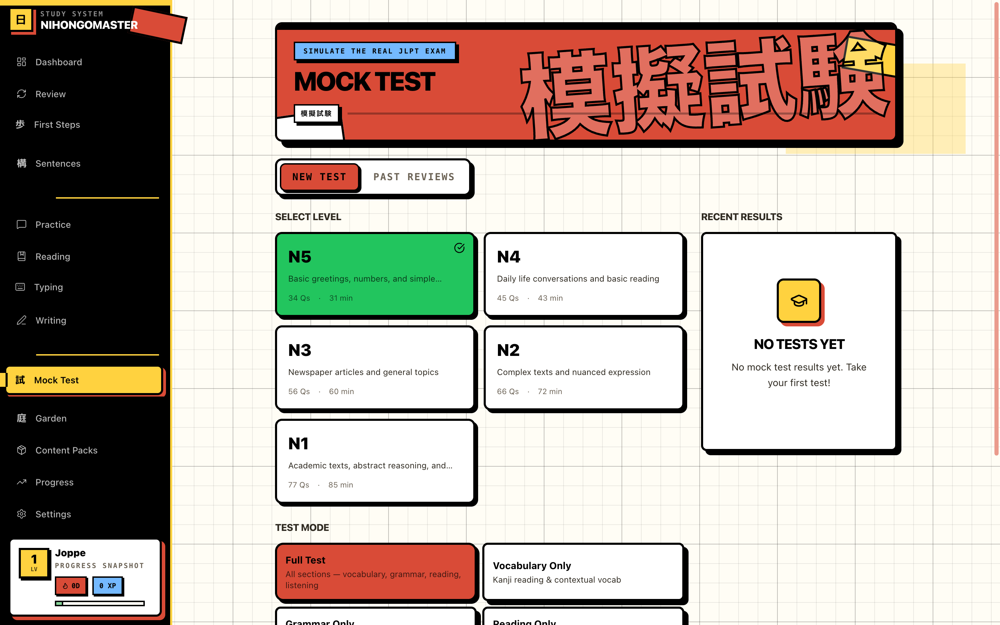
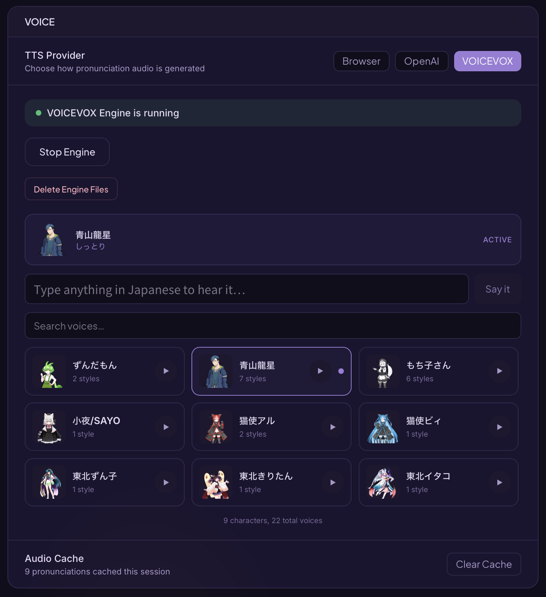
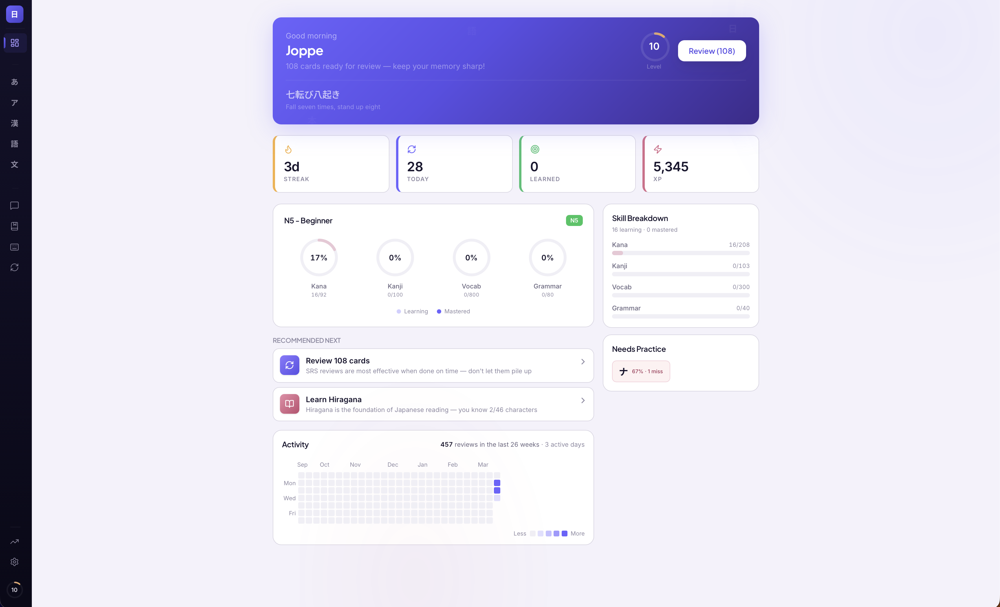

<p align="center">
  
</p>

<h1 align="center">NihongoMaster</h1>

<p align="center">
  <strong>The desktop Japanese learning app that works entirely offline.</strong><br/>
  Built with Tauri v2, React 19, Rust, and SQLite.
</p>

<p align="center">
  
  
  
  
  
  
  
</p>

<br/>

<p align="center">
  
</p>

---

## Why NihongoMaster?

Most Japanese learning apps are cloud-based, subscription-locked, and can't function without an internet connection. NihongoMaster is different.

- **100% offline after install** -- your data never leaves your machine
- **Native Japanese voices** via VOICEVOX -- real AI speech synthesis running locally on your CPU, not a robotic browser voice
- **FSRS spaced repetition** -- the same algorithm behind Anki's latest scheduler, implemented natively in Rust for speed
- **Comprehensive JLPT coverage** -- N5 through N1 kanji, vocabulary, and grammar in a single app
- **Tiny footprint** -- the entire app is under 30 MB (before optional VOICEVOX voice models)
- **No account required** -- no sign-up, no telemetry, no tracking

---

## Table of Contents

- [Features](#features)
- [Screenshots](#screenshots)
- [What Makes It Different](#what-makes-it-different)
- [VOICEVOX -- Native Japanese Voices](#voicevox----native-japanese-voices)
- [The SRS Engine](#the-srs-engine)
- [Themes](#themes)
- [Getting Started](#getting-started)
- [Local Testing Helpers](#local-testing-helpers)
- [Building from Source](#building-from-source)
- [Keyboard Shortcuts](#keyboard-shortcuts)
- [Architecture](#architecture)
- [JLPT Content](#jlpt-content)
- [Roadmap](#roadmap)
- [Credits](#credits)
---

## Features

<table>
<tr>
<td width="50%" valign="top">

### Learn
- **Kana** -- Guided Duolingo-style lessons for all 206 hiragana and katakana (including dakuten and combinations)
- **Kanji** -- Stroke-order animations from KanjiVG, thematic lesson groups, three quiz modes
- **Vocabulary** -- 6,000+ words across N5-N1, grouped by theme with teach-then-drill lessons
- **Grammar** -- 370+ patterns with formation rules, example sentences, and interactive quizzes

</td>
<td width="50%" valign="top">

### Practice
- **Sentence Builder** -- Drag tiles into correct Japanese word order across 35+ real-world scenarios
- **Fill-in-the-Blank** -- Particle, verb, and expression drills
- **Conjugation Drill** -- Verb forms (masu, te, nai, ta, tai, potential)
- **Error Correction** -- Find grammar mistakes in sentences
- **Matching Pairs** -- Timed card matching (JP-EN)
- **Dialogue Completion** -- Multi-turn conversation practice

</td>
</tr>
<tr>
<td width="50%" valign="top">

### Read & Type
- **Reading Stories** -- Mini stories using only grammar you know, with furigana toggle, sentence-by-sentence audio, and comprehension quizzes
- **Interactive Stories** -- Clickable words with instant definitions
- **Typing Practice** -- Romaji speed test and Japanese IME mode with custom word lists

</td>
<td width="50%" valign="top">

### Track
- **SRS Review** -- FSRS-powered spaced repetition for kana, kanji, vocabulary, and grammar
- **Dashboard** -- Smart study guide with personalized recommendations, activity heatmap, skill breakdown chart
- **Progress** -- Streak tracking, XP system with 30 levels, accuracy stats, daily goals
- **Achievements** -- 15 unlockable achievements with animated toast notifications

</td>
</tr>
</table>

---

## Screenshots

<p align="center">
  
  
  
</p>
<p align="center">
  
  
  
</p>

---

## What Makes It Different

| Feature | NihongoMaster | Duolingo | WaniKani | Anki |
|---|:---:|:---:|:---:|:---:|
| Works 100% offline | **Yes** | No | No | Partial |
| Native Japanese AI voices (VOICEVOX) | **Yes** | No | No | No |
| FSRS spaced repetition | **Yes** | No | SRS (custom) | Yes (plugin) |
| Kanji stroke-order animation | **Yes** | No | No | No |
| Sentence building exercises | **Yes** | Yes | No | No |
| Reading stories with comprehension | **Yes** | Yes | No | No |
| Japanese IME typing practice | **Yes** | No | No | No |
| Drawing canvas for handwriting | **Yes** | No | No | No |
| Multiple Japanese-inspired themes | **Yes** | No | No | No |
| Full data export/import | **Yes** | No | No | Yes |
| No account / No subscription | **Yes** | No | No | Yes |
| No telemetry or tracking | **Yes** | No | No | Yes |
| Native desktop performance (Rust) | **Yes** | No | No | Partial |
| App size | **~30 MB** | ~150 MB | Web | ~100 MB |
| Price | **Free** | $84/yr | $99/yr | Free |

---

## VOICEVOX -- Native Japanese Voices

NihongoMaster integrates [VOICEVOX](https://voicevox.hiroshiba.jp/), an open-source Japanese speech synthesis engine, directly into the app. This gives you **real Japanese voices** -- not the robotic browser Speech API.

### How it works

1. Open **Settings** and go to the VOICEVOX section
2. **Preview voices** -- listen to 40+ voice samples before downloading anything
3. **Select voices** -- pick the characters you want (e.g., Zundamon, Metan, Tsumugi)
4. **One-click install** -- the engine downloads (~200 MB) and extracts automatically
5. **Runs locally** -- the VOICEVOX engine starts on your machine, no internet required after install

### Voice features

- **40+ voice characters** with distinct personalities and tones
- **Speed control** -- normal and slow pronunciation for learning
- **Word-level timing** -- words highlight in sync with audio during reading
- **Automatic fallback** -- if VOICEVOX isn't installed, falls back to pre-generated Google Cloud TTS audio, then to Web Speech API

<p align="center">
  
</p>

---

## The SRS Engine

NihongoMaster uses the **FSRS (Free Spaced Repetition Scheduler)** algorithm -- the same algorithm that powers Anki's latest scheduler. Our implementation is written in **Rust** and runs natively, not in a browser sandbox.

### How FSRS works

FSRS models memory with three variables:

- **Stability** -- how long until a memory decays to 90% recall probability
- **Difficulty** -- how inherently hard the material is for you
- **Retrievability** -- the probability you can recall the item right now

After each review, the algorithm recalculates optimal intervals based on your rating (Again, Hard, Good, Easy) and your history with that specific card.

### Mastery dot system

Every item (kana, kanji, vocab, grammar) has a 5-dot mastery indicator:

| Dots | Level | Net Score | Meaning |
|------|-------|-----------|---------|
| 0 | Unseen | 0 | Not yet studied |
| 1 | Seen | 1-2 | Encountered, not yet familiar |
| 2 | Familiar | 3-5 | Recognizing consistently |
| 3 | Intermediate | 6-10 | Recalling with some effort |
| 4 | Advanced | 11-17 | Confident recall |
| 5 | Mastered | 18+ | Automatic recall |

Wrong answers **deduct progress** -- each mistake costs 3 effective points. This prevents inflated mastery from lucky guesses.

---

## Themes

NihongoMaster ships with **7 themes**, including 4 Japanese-inspired color palettes:

<table>
<tr>
<td align="center" width="25%">
  <br/>
  <strong>Light</strong><br/>
  <sub>Clean default</sub>
</td>
<td align="center" width="25%">
  <br/>
  <strong>Dark</strong><br/>
  <sub>Twilight focus</sub>
</td>
<td align="center" width="25%">
  <br/>
  <strong>Sakura</strong><br/>
  <sub>Cherry blossom pinks</sub>
</td>
<td align="center" width="25%">
  <br/>
  <strong>Matcha</strong><br/>
  <sub>Tea ceremony greens</sub>
</td>
</tr>
<tr>
<td align="center" width="25%">
  <br/>
  <strong>Fuji</strong><br/>
  <sub>Wisteria purple</sub>
</td>
<td align="center" width="25%">
  <br/>
  <strong>Momiji</strong><br/>
  <sub>Autumn maple reds</sub>
</td>
<td align="center" width="25%">
  <br/>
  <strong>System</strong><br/>
  <sub>Follows OS preference</sub>
</td>
<td width="25%"></td>
</tr>
</table>

Each theme overrides the entire design system: backgrounds, text colors, borders, accents, gradients, shadows, scrollbars, and glow effects. Smooth 500ms transitions when switching.

---

## Getting Started

### Prerequisites

- [Node.js](https://nodejs.org/) >= 18
- [Rust](https://rustup.rs/) (latest stable)
- Platform dependencies for Tauri v2:
  - **macOS:** Xcode Command Line Tools
  - **Windows:** Visual Studio Build Tools, WebView2
  - **Linux:** `webkit2gtk-4.1`, `libappindicator3-dev`, `librsvg2-dev`

### Install & Run

```bash
# Clone the repository
git clone https://github.com/joppe2001/NihongoMaster.git
cd NihongoMaster

# Install dependencies
npm install

# Start in development mode
npm run tauri:dev
```

The app opens at `localhost:1420` inside a native Tauri window. The SQLite database initializes automatically on first launch with all JLPT content.

### Optional: Generate audio files

Pre-generated audio files for offline pronunciation are included. To regenerate them (requires a Google Cloud TTS API key):

```bash
# Generate all audio (kana + kanji + vocab)
npm run generate-audio

# Generate specific types
npm run generate-audio:kana
npm run generate-audio:vocab
npm run generate-audio:kanji

# Generate slow-speed variants
npm run generate-audio:slow
```

---

## Local Testing Helpers

### Switch the local test account level

For local testing, two values matter:

- `settings.value` where `key = 'learning_profile'` holds `placedLevel` and `placedSublevel`. This drives the dashboard roadmap, journey routing, and onboarding-based placement.
- `users.current_level` holds the numeric JLPT level used by level-scoped features such as content filtering and typing defaults.

The app currently boots the first row from `users` (`SELECT * FROM users LIMIT 1`), so the commands below update that same row directly.

On macOS dev installs, the SQLite file is:

```bash
DB="$HOME/Library/Application Support/com.nihongomaster.app/nihongo-master.db"
```

Inspect the active local placement:

```bash
sqlite3 "$DB" "
SELECT id, name, current_level FROM users;
SELECT
  json_extract(value, '$.placedLevel') AS placed_level,
  json_extract(value, '$.placedSublevel') AS placed_sublevel
FROM settings
WHERE key = 'learning_profile';
"
```

Useful sublevels for dashboard and journey testing:

| `placedSublevel` | What it unlocks |
|---|---|
| `absolute-beginner` | Beginner Journey is the first dashboard roadmap stage |
| `kana-learner` | Beginner Journey remains visible, but the roadmap assumes some kana progress |
| `n5-early` | Skips the beginner journey on the dashboard and starts the N5 roadmap |
| `n5-late` | Late N5 roadmap |
| `n4-early` / `n4-late` | N4 roadmap and N4 journey routing |
| `n3-plus` | N3 roadmap and N3 journey routing |

Common switches:

```bash
# Show Beginner Journey on the dashboard again
sqlite3 "$DB" "
UPDATE users
SET current_level = 5
WHERE id = (SELECT id FROM users LIMIT 1);
UPDATE settings
SET value = json_set(value, '$.placedLevel', 5, '$.placedSublevel', 'absolute-beginner')
WHERE key = 'learning_profile';
"
```

```bash
# Test N5 after the beginner roadmap
sqlite3 "$DB" "
UPDATE users
SET current_level = 5
WHERE id = (SELECT id FROM users LIMIT 1);
UPDATE settings
SET value = json_set(value, '$.placedLevel', 5, '$.placedSublevel', 'n5-early')
WHERE key = 'learning_profile';
"
```

```bash
# Test N4 roadmap / journey
sqlite3 "$DB" "
UPDATE users
SET current_level = 4
WHERE id = (SELECT id FROM users LIMIT 1);
UPDATE settings
SET value = json_set(value, '$.placedLevel', 4, '$.placedSublevel', 'n4-early')
WHERE key = 'learning_profile';
"
```

```bash
# Test N3 roadmap / journey
sqlite3 "$DB" "
UPDATE users
SET current_level = 3
WHERE id = (SELECT id FROM users LIMIT 1);
UPDATE settings
SET value = json_set(value, '$.placedLevel', 3, '$.placedSublevel', 'n3-plus')
WHERE key = 'learning_profile';
"
```

Notes:

- Restart or reload the app after changing the database so the in-memory store picks up the new placement.
- Changing placement does not reset progress by itself. It only changes what the dashboard and journey system point to.
- Leave `beginner_journey_state` and progress tables alone unless you explicitly want to reset journey progress too.
- If the `learning_profile` row is missing entirely, rerun onboarding instead of handcrafting partial JSON.

---

## Building from Source

### macOS (.dmg)

```bash
npm run tauri:build:dmg
```

Output: `src-tauri/target/release/bundle/dmg/NihongoMaster_0.1.0_aarch64.dmg`

### macOS (.app)

```bash
npm run tauri:build:app
```

### Windows (.exe / .msi)

> Must be run on a Windows machine with Visual Studio Build Tools and WebView2 installed.

```bash
npm run tauri:build:windows
```

Output: `src-tauri/target/release/bundle/nsis/NihongoMaster_0.1.0_x64-setup.exe` and `.msi`

### Linux (.deb / .AppImage / .rpm)

> Must be run on a Linux machine with `webkit2gtk-4.1`, `libappindicator3-dev`, and `librsvg2-dev` installed.

```bash
npm run tauri:build:linux
```

Output: `src-tauri/target/release/bundle/deb/`, `appimage/`, and `rpm/`

### All platforms

```bash
npm run tauri:build
```

This creates platform-appropriate installers (.dmg, .app, .exe, .deb, .rpm, .AppImage).

> **Note:** Tauri requires building on the target platform. To produce binaries for all platforms, run the respective build command on each OS or use a CI/CD pipeline (e.g., GitHub Actions) with macOS, Windows, and Linux runners.

---

## Keyboard Shortcuts

| Context | Shortcut | Action |
|---------|----------|--------|
| **Review** | `Space` | Show answer |
| **Review** | `1` `2` `3` `4` | Rate: Again / Hard / Good / Easy |
| **Quiz** | `1` `2` `3` `4` | Select multiple-choice option |
| **Quiz** | `Enter` | Check answer / Continue |
| **Quiz** | `Space` | Advance teach step |
| **Lesson** | `Enter` / `Space` | Advance to next step |
| **Fill-in-the-Blank** | `1` `2` `3` `4` | Select option |
| **General** | `Cmd/Ctrl + ,` | Open settings |

---

## Architecture

```
NihongoMaster
├── src/                        # React 19 frontend
│   ├── pages/                  # 12 page components (lazy-loaded)
│   ├── components/             # 15 component directories
│   │   ├── kana/               # Kana grid, lessons, quizzes
│   │   ├── kanji/              # Stroke animation, lessons
│   │   ├── vocab/              # Vocabulary lessons, browse
│   │   ├── grammar/            # Grammar lessons, browse
│   │   ├── exercises/          # 6 practice exercise types
│   │   ├── reading/            # Interactive story reader
│   │   ├── typing/             # IME and romaji typing
│   │   ├── voicevox/           # VOICEVOX setup & voice picker
│   │   ├── srs/                # Review card components
│   │   ├── dashboard/          # Heatmap, stats, study guide
│   │   ├── onboarding/         # First-launch wizard
│   │   └── shared/             # FuriganaText, AudioButton, etc.
│   ├── services/               # 22 service modules
│   ├── stores/                 # 6 Zustand stores
│   ├── data/                   # 54 data files (JLPT content)
│   ├── hooks/                  # Custom React hooks
│   ├── lib/                    # Utilities, animations, types
│   ├── i18n/                   # Internationalization
│   └── styles/                 # Tailwind + Japanese themes
│
├── src-tauri/                  # Rust backend
│   └── src/
│       ├── srs/                # FSRS algorithm (Rust)
│       │   ├── fsrs.rs         # Core FSRS implementation
│       │   └── scheduler.rs    # Review scheduling
│       ├── commands/           # Tauri IPC commands
│       │   ├── cards.rs        # SRS card operations
│       │   ├── review.rs       # Review submission
│       │   └── progress.rs     # Progress & XP tracking
│       ├── voicevox.rs         # VOICEVOX engine management
│       └── db/                 # Database migrations
│
├── public/
│   ├── app-icon.png
│   └── voicevox-samples/       # 40 voice preview samples
│
└── scripts/
    └── generate-audio.ts       # Build-time audio generation
```

### Tech Stack

| Layer | Technology | Purpose |
|-------|-----------|---------|
| **Runtime** | [Tauri v2](https://tauri.app) | Native desktop shell, IPC, file system |
| **Frontend** | [React 19](https://react.dev) + TypeScript | UI components and state |
| **Styling** | [Tailwind CSS v4](https://tailwindcss.com) | Utility-first CSS with custom themes |
| **State** | [Zustand](https://zustand.docs.pmnd.rs/) | Lightweight state management |
| **Animation** | [Framer Motion](https://www.framer.com/motion/) | Page transitions, micro-interactions |
| **UI** | [Radix UI](https://www.radix-ui.com/) | Accessible dialog, tabs, tooltips |
| **Charts** | [Recharts](https://recharts.org) | Dashboard charts and progress graphs |
| **Icons** | [Lucide React](https://lucide.dev) | 1,700+ tree-shakable icons |
| **Backend** | [Rust](https://www.rust-lang.org/) | FSRS engine, IPC commands, VOICEVOX |
| **Database** | [SQLite](https://www.sqlite.org/) | All user data, SRS cards, progress |
| **Build** | [Vite](https://vitejs.dev/) | Frontend bundling with HMR |
| **Audio** | [VOICEVOX](https://voicevox.hiroshiba.jp/) | Japanese speech synthesis (local) |
| **Stroke Data** | [KanjiVG](https://kanjivg.tagaini.net/) | Kanji & kana stroke paths |
| **i18n** | [i18next](https://www.i18next.com/) | Interface localization |

---

## JLPT Content

All content is bundled with the app -- no downloads required.

| Level | Kanji | Vocabulary | Grammar | Status |
|-------|------:|----------:|--------:|--------|
| **N5** | 104 | 600+ | 41 | Complete |
| **N4** | 200+ | 700+ | 57 | Complete |
| **N3** | 300+ | 1,000+ | 60+ | Complete |
| **N2** | 400+ | 700+ | 42+ | Complete |
| **N1** | 800+ | 3,000+ | 200+ | Complete |
| **Total** | **1,800+** | **6,000+** | **400+** | |

Additionally:
- 42 radical definitions with example kanji
- 200+ kanji compound words (jukugo)
- 92 kana mnemonics for memorization
- KanjiVG stroke data for all N5 + N4 kanji
- 35+ sentence building exercises across 8 scenarios
- 7 reading stories with comprehension quizzes

---

## Roadmap

### Planned
- [ ] Pitch accent visualization
- [ ] Handwriting recognition (on-device ML)
- [ ] Grammar conjugation tables
- [ ] Community shared mnemonics
- [ ] Mobile companion (Tauri v2 iOS/Android)
- [ ] Traditional Chinese interface (zh-TW) -- i18n architecture is ready, needs translations
- [ ] Shadowing practice -- listen-then-repeat with word-by-word audio sync
- [ ] Spoken conversation practice -- on-device speech recognition

### Recently Shipped
- [x] N1 content (kanji, vocabulary, grammar)
- [x] iOS & Mac App Store release
- [x] Custom content packs (Yomitan-style JSON/CSV/Anki import)
- [x] Listening comprehension (single sentences + full conversation scenarios)
- [x] Dual VOICEVOX voices in conversations (auto opposite-gender pairing)
- [x] Kana character management (hide/show/add/delete individual characters)
- [x] In-app update popup + What's New modal after each update
- [x] Voice model management (add/remove individual VOICEVOX voices)
- [x] Download statistics from GitHub Releases API

---

## Credits

- **[VOICEVOX](https://voicevox.hiroshiba.jp/)** -- Open-source Japanese speech synthesis engine by Hiroshiba
- **[KanjiVG](https://kanjivg.tagaini.net/)** -- Kanji stroke order data (CC BY-SA 3.0) by Ulrich Apel
- **[FSRS](https://github.com/open-spaced-repetition/fsrs4anki)** -- Free Spaced Repetition Scheduler algorithm by Jarrett Ye
- **[Tauri](https://tauri.app)** -- Framework for building desktop apps with web frontends
- **[Google Cloud TTS](https://cloud.google.com/text-to-speech)** -- Neural2-B voice used for pre-generated audio files

---

<p align="center">
  <sub>Built with care for Japanese learners who value privacy, performance, and beautiful design.</sub>
</p>
